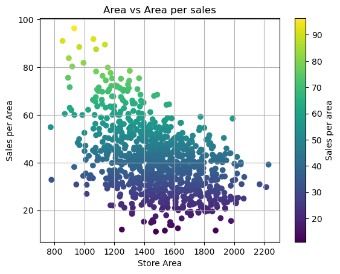
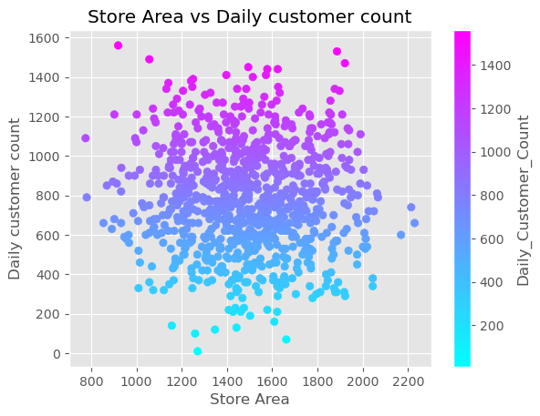
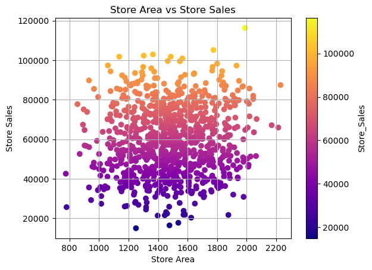
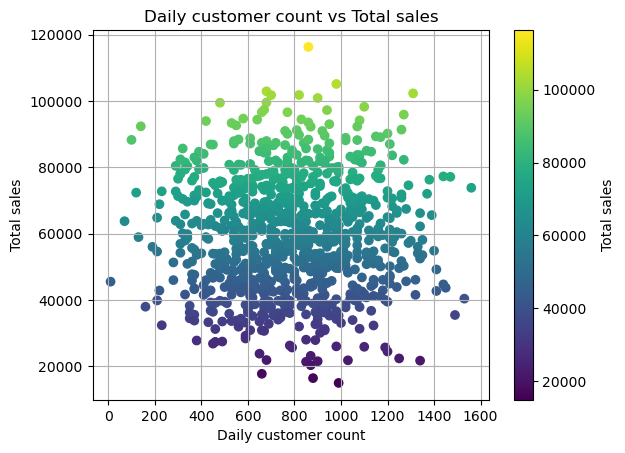
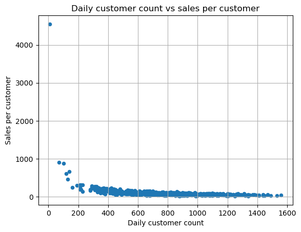

# 📊 Sales Analysis Project

## 📌 Overview
This project focuses on analyzing retail sales data to uncover patterns and generate actionable business insights. The goal is to understand how different factors like store size and customer count impact overall sales performance.

---

## 🛠️ Tools & Technologies
- Python
- NumPy
- Pandas
- Matplotlib

---

## 📂 Dataset Description
The dataset includes the following key features:
- Store Area
- Store Sales
- Daily Customer Count
- Sales per Customer

---

## 📊 Analysis Performed
- Data Cleaning & Preprocessing  
- Correlation Analysis  
- Sales vs Store Area Analysis  
- Customer Behavior Analysis  
- Data Visualization  

---

## 📈 Key Insights
- Store area shows weak correlation with sales  
- Customer count has a stronger impact on revenue  
- Smaller stores can outperform larger stores  
- Sales efficiency varies significantly across stores  

---

## 📊 Visualizations

### 1. Area vs Sales per Customer
  
➡️ Insight: Store size does not strongly influence sales efficiency per customer.

### 2. Area vs Daily Customer Count
  
➡️ Insight: Larger stores do not necessarily attract more customers.

### 3. Area vs Sales
  
➡️ Insight: Weak relationship between store area and total sales.

### 4. Daily Customer Count vs Sales
  
➡️ Insight: Strong positive relationship between customers and sales.

### 5. Daily Customer Count vs Sales per Customer
  
➡️ Insight: Sales per customer remains relatively stable across different traffic levels.

---

## 🚀 How to Run

1. Clone the repository  
2. Install dependencies:

pip install -r requirements.txt

3. Open and run the Jupyter Notebook  

---

## 👨‍💻 Author
Abhinibesh Mal